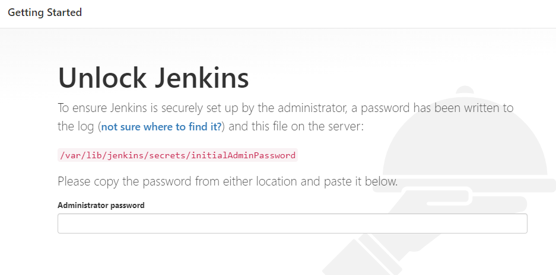

## PROJECT 9

## TOOLING WEBSITE DEPLOYMENT AUTOMATION WITH CONTINUOUS INTEGRATION. INTRODUCTION TO JENKINS

In previous Project 8 we introduced horizontal scalability concept, which allow us to add new Web Servers to our Tooling Website and you have successfully deployed a set up with 3 Web Servers and also a Load Balancer to distribute traffic between them. If it is just two or three servers – it is not a big deal to configure them manually. Imagine that you would need to repeat the same task over and over again adding dozens or even hundreds of servers.

DevOps is about Agility, and speedy release of software and web solutions. One of the ways to guarantee fast and repeatable deployments is Automation of routine tasks.

In this project we are going to start automating part of our routine tasks with a free and open source automation server – Jenkins. It is one of the mostl popular CI/CD tools, it was created by a former Sun Microsystems developer Kohsuke Kawaguchi and the project originally had a named "Hudson".

Acording to Circle CI, Continuous integration (CI) is a software development strategy that increases the speed of development while ensuring the quality of the code that teams deploy. Developers continually commit code in small increments (at least daily, or even several times a day), which is then automatically built and tested before it is merged with the shared repository.

In our project we are going to utilize Jenkins CI capabilities to make sure that every change made to the source code in GitHub https://github.com/<yourname>/tooling will be automatically be updated to the Tooling Website.

## Task

Enhance the architecture prepared in Project 8 by adding a Jenkins server, configure a job to automatically deploy source codes changes from Git to NFS server.

Here is how your updated architecture will look like upon completion of this project:


### INSTALL AND CONFIGURE JENKINS SERVER

### Step 1 – Install Jenkins server

1. Create an AWS EC2 server based on Ubuntu Server 20.04 LTS and name it "Jenkins"

2. Install JDK (since Jenkins is a Java-based application)

```
        sudo apt update
        sudo apt install default-jdk-headless
```

3. Install Jenkins

```
        wget -q -O - https://pkg.jenkins.io/debian-stable/jenkins.io.key | sudo apt-key add -
        sudo sh -c 'echo deb https://pkg.jenkins.io/debian-stable binary/ > \
            /etc/apt/sources.list.d/jenkins.list'
        sudo apt update
        sudo apt-get install jenkins
```

Make sure Jenkins is up and running

        'sudo systemctl status jenkins'


4. By default Jenkins server uses TCP port 8080 – open it by creating a new Inbound Rule in your EC2 Security Group

5. Perform initial Jenkins setup.

From your browser access http://<Jenkins-Server-Public-IP-Address-or-Public-DNS-Name>:8080



You will be prompted to provide a default admin password


Retrieve it from your server:

        'sudo cat /var/lib/jenkins/secrets/initialAdminPassword'

Then you will be asked which plugings to install – choose suggested plugins.


Once plugins installation is done – create an admin user and you will get your Jenkins server address.

The installation is completed!


### Step 2 – Configure Jenkins to retrieve source codes from GitHub using Webhooks

In this part, you will learn how to configure a simple Jenkins job/project. This job will be triggered by GitHub webhooks and will execute a ‘build’ task to retrieve codes from GitHub and store it locally on Jenkins server.

1. Enable webhooks in your GitHub repository settings

- Go to the repo that you forked and enable webhook. Set content type: application/jason

`http://<jenkins-public-ip-address:8080>/github-webhook/`

- Check : **just the push event**

- Click : **Add webhook**

2. Go to Jenkins web console, click "New Item" and create a "Freestyle project"

To connect your GitHub repository, you will need to provide its URL, you can copy from the repository itself (in this case Tooling repo)

In configuration of your Jenkins freestyle project choose Git repository, provide there the link to your Tooling GitHub repository and credentials (user/password) so Jenkins could access files in the repository. Remember to select the credentials you enabled

## Blocker

I encountered this error when suppling the github credentials

'HTTP ERROR 403 No valid crumb was included in the request'

To resolve it, I have to check the box for the option **Enable proxy compactibility** which is under **Configure Global Security** under **Manage Jenkins** on the jenkins dashboard.

Save the configuration and let us try to run the build. For now we can only do it manually.

Click "Build Now" button, if you have configured everything correctly, the build will be successfull and you will see it under #1
You can open the build and check in "Console Output" if it has run successfully.

If so – congratulations! You have just made your very first Jenkins build!

But this build does not produce anything and it runs only when we trigger it manually. Let us fix it.


3. Click "Configure" your job/project and add these two configurations

- Configure triggering the job from GitHub webhook: check the box for **GitHub hook trigger for GITScm polling**

- Configure "Post-build Actions" to archive all the files – files resulted from a build are called "artifacts": Click the button for **Post-build Action**, select **Archive the artifacts** and in the box for **files to be archived** put **(**)** to archive all the files 

Now, go ahead and make some change in any file in your GitHub repository (e.g. README.MD file) and push the changes to the master branch.


You will see that a new build has been launched automatically (by webhook) and you can see its results – artifacts, saved on Jenkins server.


You have now configured an automated Jenkins job that receives files from GitHub by webhook trigger (this method is considered as ‘push’ because the changes are being ‘pushed’ and files transfer is initiated by GitHub). There are also other methods: trigger one job (downstreadm) from another (upstream), poll GitHub periodically and others.

By default, the artifacts are stored on Jenkins server locally

        'ls /var/lib/jenkins/jobs/project-9/builds/<build number>/archive/<file name>'


### Step 3 – Configure Jenkins to copy files to NFS server via SSH


Now we have our artifacts saved locally on Jenkins server, the next step is to copy them to our NFS server to /mnt/apps directory.

Jenkins is a highly extendable application and there are 1400+ plugins available. We will need a plugin that is called "Publish Over SSH".

1. Install "Publish Over SSH" plugin.

On main dashboard select "Manage Jenkins" and choose "Manage Plugins" menu item.

On "Available" tab search for "Publish Over SSH" plugin and install it

2. Configure the job/project to copy artifacts over to NFS server.

On main dashboard select "Manage Jenkins" and choose "Configure System" menu item.

Scroll down to Publish over SSH plugin configuration section and configure it to be able to connect to your NFS server:

1. Provide a private key (content of .pem file that you use to connect to NFS server via SSH/Putty)
2. Arbitrary name (NFS)
3. Hostname – can be private IP address of your NFS server
4. Username – ec2-user (since NFS server is based on EC2 with RHEL 8)
5. Remote directory – /mnt/apps since our Web Servers use it as a mointing point to retrieve files from the NFS server

Test the configuration and make sure the connection returns Success. Remember, that TCP port 22 on NFS server must be open to receive SSH connections.


Save the configuration, open your Jenkins job/project configuration page and add another one "Post-build Action"

Configure it to send all files probuced by the build into our previously define remote directory. In our case we want to copy all files and directories – so we use **.

Save this configuration and go ahead, change something in README.MD file in your GitHub Tooling repository.

Webhook will trigger a new job and in the "Console Output" of the job you will find something like this:

```
        SSH: Transferred 25 file(s)
        Finished: SUCCESS
```
However, the console output came out permission denied


Trouble shooting the error

From nfs server, run the following commands

```
                ls -l /mnt/apps

                sudo chown -R nobody:nobody /mnt

                sudo chown -R ec2-user:ec2-user /mnt
```
Remember that during the  **Publish over SSH plugin configuration section** we put in the user to be **ec2-user**, therefore the last command above is changing the ownership of **/mnt** to **ec2-user** so that nfs server can be able to access jenkins server
 


The build is now successful


To make sure that the files in /mnt/apps have been udated – connect via SSH/Putty to your NFS server and check README.MD file

        'cat /mnt/apps/README.md'

If you see the changes you had previously made in your GitHub – the job works as expected.


### End of Project 9